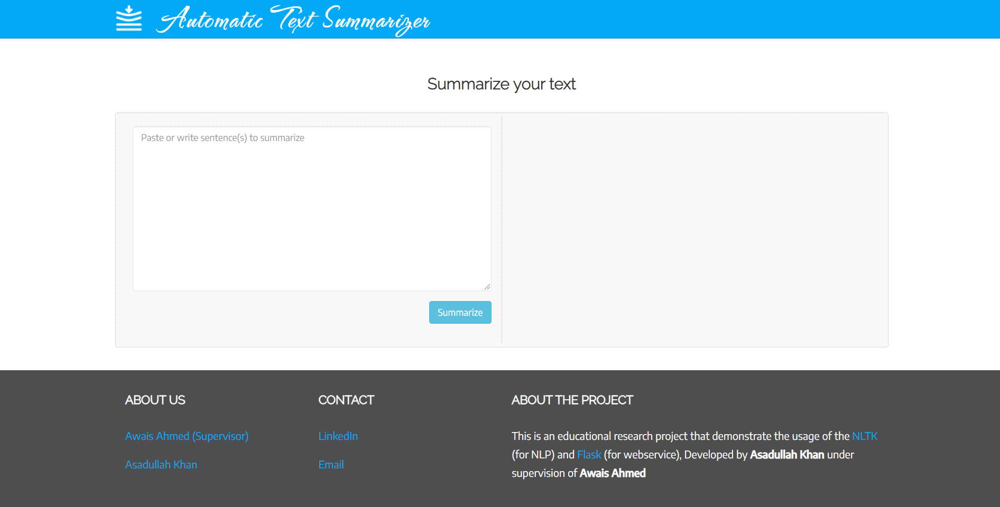
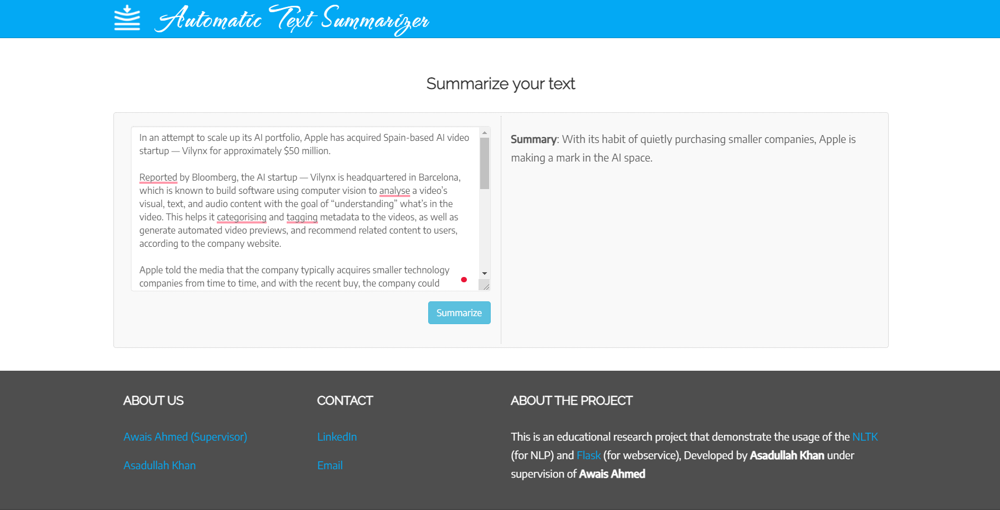

# Automatic Text Summarization, Powered by [asadullah-kr](https://github.com/asadullah-kr).

## A Flask application that summarize any given text using Natural Language Processing.

<p align="center">

<p>

# Index

* [Need](#motivation)
* [How to start](#how-to-start)
* [Requirements](#requirements)
* [Implementation](#implementation)
* [Contribution](#contribution)
* [Ideas](#ideas)
* [Credits](#credits)

## Need

Need of this project is to display the different text summarization algorithm in action I have created an  production ready API for **Text Summarization Algorithms** and make it available to test it with different available algorithms. This project implements a NLP algorithm using Python and serves using flask API.

## How to start

You need to manually clone or download this repository. Project is ready to run (with some requirements).

You need to run ```app.py``` file in your development environment.

>Open http://127.0.0.1:5000/, customize project files and **have fun**.

## Requirements

The suggested way is to use ```python virtual environment```. The project is developed using ```python 3.7.1```

### Included modules support

#### Python
This project uses very simple <b>python web framework called [Flask](http://flask.pocoo.org/)</b>, which is very easy to learn and adopt. (even scale!!!)

The <b>[NLTK](https://www.nltk.org) - Natural Language ToolKit</b> is used for the Text Summarization Algorithm implementation.

#### HTML

The HTML Template used in this project is <b>[Stanley](https://templatemag.com/stanley-bootstrap-freelancer-template/) - Bootstrap Freelancer Template</b>.

#### JavaScript

- Vanilla Javascript

#### CSS

- Vanilla CSS

#### Installation
Run requirements.txt to install the required python packages.

```
$ pip install -r requirements.txt
```
---
## Implementation

#### Project Structure 
```
|───config/
|───framework/
|───implementaion/
|───static/
|───templates/
|───app.py
|───wsgi.py
```


---
#### Summarization Algorithm
    ├──implementaion
    | |──word_frequency_summarize_parser.py
    | |──TF_IDF_Summarization.py
    | |──t5_summarization.py

    


---
#### Flask service
 
    ├──app.py

What if we want to make our Algorithm as servable API? (**SAAS startup ???**)
Yes! we can do that, The app.py is flask module which serves an API that summarize the webpage

    # `summarize` method takes three arguments as input (text pragraph, method and size) and returns the summarized text as json object
    @app.route('/v1/summarize', methods=['GET'])
    def summarize():
        ...

##### Usage: 
This is a GET API which can be queried easily using CURL, Postman or your favourite browser.

``ie, GET /v1/summarize?textStr=your-input-text-or-paragraph&method=1&summarySize=small``

OR via browser

``http://localhost:5000/v1/summarize?textStr=your-input-text-or-paragraph&method=1&summarySize=small``

---
#### Let's add some UI
    ├──templates
    ├ ├──index.html
    ├──static
    ├ ├──assets
    ├ ├ ├──css
    ├ ├ ├──js

##### 1. Accept the text/paragraphs from the user 
The following interface takes the website url and request the API we've developed using ajax.
<p align="center">

<p>

##### 2. Ajax request using javascript: main.js

    $.ajax({
            url: baseUrl,
            type: "post",
            data: {
                'textstr'   : textstr,
                'method'    : parseInt(method),
                'summarySize' : summarySize
            }
        }).then(function(data) {
            processSummary(textstr, data.summary);
        });


##### 3. Process API response and display on UI
The API response is displayed on the HTML page using javascript.

    var summary = document.createElement('p');
    summary.innerHTML = "<b>Summary</b>: " + summaryData;
    $('#summary').append(summary);

<p align="center">

<p>

### Contribution
Feel free to raise an issue for bug or feature request And pull request for any kind of improvements.

### Ideas
If you find this project interesting, you can do pretty more now, followings ideas might help you.

- We can add few more algorithms to play with using this small application.
- Display list of sentences instead of paragraph.
- Create chrome plugin and highlight the sentences.

### Credits

This application uses Open Source components. You can find the source code of their open source projects along with license information below.

I acknowledge and is grateful to these developers for their contributions to open source.

##### HTML template theme
    Project: Stanley - HTML theme by TemplateMag (https://templatemag.com)
    Copyrights Stanley. All Rights Reserved.
    Licensing information: https://templatemag.com/license/
